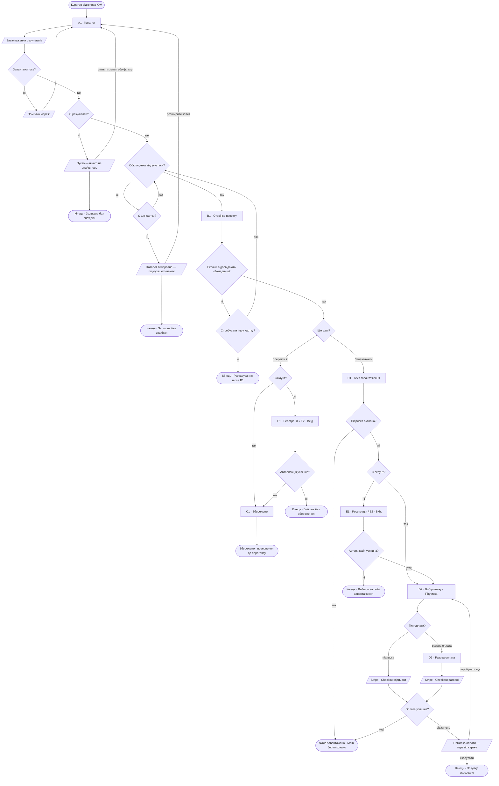
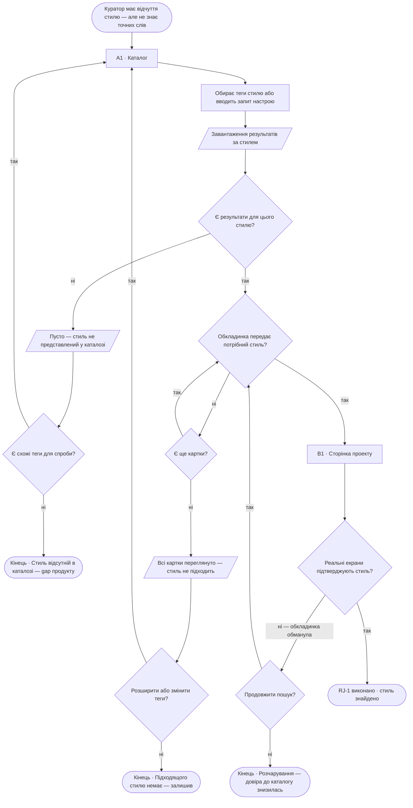
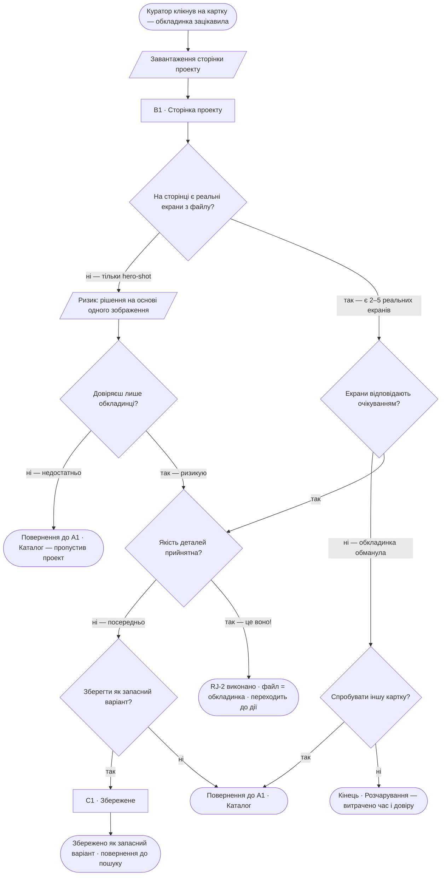
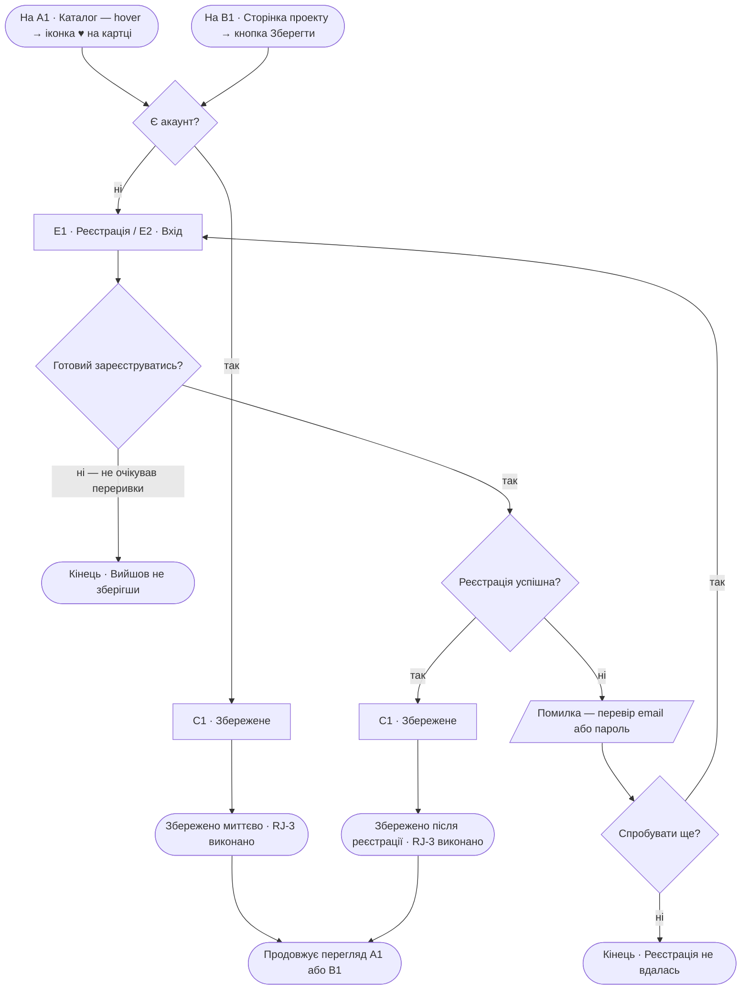

# Kiwi — User Flows

> Джерело правди: jtbd.md + sitemap.md  
> Flows — відображення логіки, не дизайн-рішення  
> Кожен вузол-екран існує в sitemap.md · стани (loading / empty / error) — не екрани  

**Легенда:**
| Форма | Значення |
|-------|----------|
| `[прямокутник]` | Екран або дія (з sitemap.md) |
| `{ромб}` | Точка рішення з гілками |
| `[/нахилений/]` | Стан: loading / empty / error |
| `([заокруглений])` | Термінальний стан: успіх або тупик |

---

## Main Job · Знайти готовий ресурс і отримати файл

**Job:** Коли я знаю що треба зробити але не хочу починати з нуля,  
я хочу знайти готовий ресурс що відповідає стилю і потребам проекту,  
щоб вийти на результат швидше, не жертвуючи якістю.

**Персона:** Куратор · primary · ✅ validated

---

## RJ-1 · Знайти за стилем, а не категорією

**Job:** Коли я маю відчуття потрібної естетики але не слів для точного пошуку,  
я хочу знаходити ресурси за настроєм і візуальним характером,  
щоб не витрачати годину на підбір тегів і все одно прийти ні з чим.

**Персона:** Куратор · primary · ✅ validated · «Не міг знайти нудний стиль — за запитами їх просто не було»

---

## RJ-2 · Переконатись що файл відповідає обкладинці

**Job:** Коли я бачу обкладинку що зацікавила,  
я хочу побачити реальний вміст файлу до того як приймати рішення,  
щоб не витрачати час і емоції на розчарування після переходу.

**Персона:** Куратор · primary · ✅ validated · «Обкладинка виглядає добре, але при детальному розгляді дизайн посередній»

---

## RJ-3 · Зберегти що сподобалось без зайвих кроків

**Job:** Коли я знаходжу ресурс що може стати в нагоді пізніше,  
я хочу відкласти його в одне місце миттєво,  
щоб повернутись коли прийде відповідний проект, не шукаючи знову.

**Персона:** Куратор · primary · ✅ validated · «Або одразу зберігаю в обране, або одразу скачую»

---

> Останнє оновлення: червень 2026  
> Джерела: jtbd.md · sitemap.md  
> Нові екрани в flows: не додано — всі вузли-екрани існують у sitemap.md
